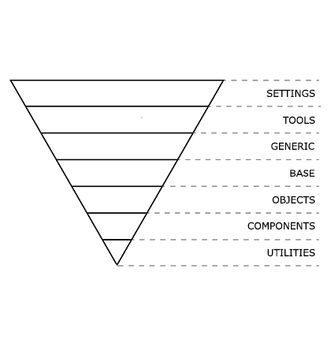
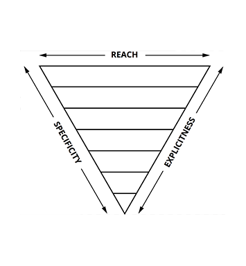

# Les 7 capes de CSS

Cada projecte necessita alguna organització. Escriure qualsevol nou estil al final del fitxer converteix les coses en ingestionables i confuses per qualsevol altra persona que treballi en el projecte.

La base d'aquesta guia és la categorització. Categoritzant les regles de CSS es comencen a definir patrons i podem marcar unes bones pràctiques a seguir.

El CSS s'organitza en 7 capes en forma de triangle invertit:

Les capes són les següents:

* **1-Settings**: variables globals de configuració, definició de colors, etc.

* **2-Tools**: mixins i funcions globals. És important que no existeixi cap output de CSS en aquestes dues primeres capes \(_i.e._ un projecte amb només Settings i Tools hauria de generar un arxiu CSS buit\).

* **3-Generic**: reset/normalització d'estils, box-sizing, etc. És la primera capa que genera CSS compilat.

* **4-Base**: estils base, o sigui, els estils per elements HTML purs \(H1, A, TABLE, etc\). Aquests elements tenen estils per defecte del navegador, així que es poden redefinir aquí. Habitualment serà la primera capa que genera CSS que personalitzarem en un projecte.

* **5-Objects**: Selectors basats en classes que defineixen patrons de disseny sense estil, abstractes, com per exemple el [Media Object](http://www.stubbornella.org/content/2010/06/25/the-media-object-saves-hundreds-of-lines-of-code/) o el [Nav](https://csswizardry.com/2011/09/the-nav-abstraction/). Aquests objects estan basats en [OOCSS, Object Oriented CSS](https://www.smashingmagazine.com/2011/12/an-introduction-to-object-oriented-css-oocss/). Modificar alguna propietat CSS d'un Object és una acció delicada que probablement tingui conseqüències més enllà de la modificació d'una instància concreta.

* **6-Components**: components específics de la UI. Aquí és on es desenvolupa la gran majoria de la feina en cada projecte. Els components d'una interfície acostumen a estar compostos d'Objectes i Components. Modificar un component no ha de tenir conseqüències fora del context que estiguem desenvolupant.

* **7-Utilities**: classes d'utilitat i helpers amb la capacitat de sobreescriure qualsevol regla definida prèviament en el triangle, e.g. classes per amagar contingut. Probablement utilitzin `!important` en les seves definicions.

La forma de triangle mostra com els estils generats s'ordenen: d'estils genèrics a explícits, de poc específics a més específics, i des de globals a atòmics.

Tot el CSS queda ordenat, doncs, segons aquestes tres mètriques:

1. **De genèric a explícit**. Comencem definint els atributs més genèrics, amb un abast més ampli, de baix nivell, i anem movent-nos cap a selectors més concrets i a mesura que anem baixant de nivell.

2. **De baixa a alta especificitat**. Els selectors amb menys especificitat apareixen més a prop de l'inici del CSS, i l'especificitat va augmentant progressivament a mida que avancem en el codi. D'aquesta manera evitem "guerres d'especificitat" tan com sigui possible. L'especificitat sempre creix cap avall.

3. **D'ampli espectre a localitzat**. Selectors del principi del CSS afecten àmpliament al DOM, i cada vegada els selectors afectaran a elements més concrets.

Font: [Manage large CSS projects with ITCSS](http://www.creativebloq.com/web-design/manage-large-css-projects-itcss-101517528)

Font: [ITCSS: Scalable and Mantainable CSS Architecture](https://www.xfive.co/blog/itcss-scalable-maintainable-css-architecture/)

## 

